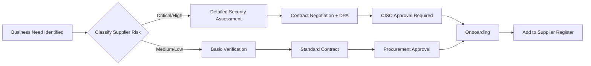

# Supplier Security Policy | นโยบายความมั่นคงปลอดภัยผู้ให้บริการ

**Document Control | การควบคุมเอกสาร**

| Field | Value |
|-------|-------|
| **Document ID** | POL-004 |
| **Version** | 1.0 |
| **Effective Date** | [To be filled - วันที่มีผลบังคับใช้] |
| **Review Date** | [Annual - ทบทวนทุกปี] |
| **Document Owner** | Chief Information Security Officer (CISO) |
| **Approved By** | Chief Executive Officer (CEO) |
| **Classification** | Internal Use Only - ใช้ภายในองค์กรเท่านั้น |
| **Related Standards** | ISO 27001:2022 A.5.19, A.5.20, A.5.21, A.5.22 |

---

## 1. Purpose and Scope | วัตถุประสงค์และขอบเขต

### 1.1 Purpose | วัตถุประสงค์

This policy establishes Certogo's requirements for managing information security risks introduced by third-party suppliers, vendors, and service providers. Given Certogo's integration with **E-KYC services that process highly sensitive biometric data**, robust supplier security management is critical to:

- Protect customer data, especially biometric data 🔴
- Ensure compliance with Thailand PDPA and ISO 27001:2022
- Maintain service availability and business continuity
- **Enable provider changes when necessary** while minimizing disruption 🔴
- Define clear security responsibilities between Certogo and suppliers

**Thai | ไทย**: นโยบายนี้กำหนดข้อกำหนดของ Certogo สำหรับการจัดการความเสี่ยงด้านความมั่นคงปลอดภัยสารสนเทศที่เกิดจากผู้ให้บริการ ผู้จำหน่าย และผู้ให้บริการบุคคลที่สาม

### 1.2 Scope | ขอบเขต

This policy applies to:

**Supplier Categories | ประเภทผู้ให้บริการ**:

1. **🔴 CRITICAL Suppliers** - Handle biometric data or critical business functions:
   - **E-KYC providers** (current: Appman Co., Ltd.)
   - Cloud infrastructure providers (AWS, Azure, GCP)
   - Database hosting providers
   - Identity and Access Management (IAM) providers

2. **🟠 HIGH-RISK Suppliers** - Handle PII or have system access:
   - Email service providers
   - Customer support platforms
   - Payment processors (if applicable)
   - Security monitoring tools (SIEM, EDR)

3. **🟡 MEDIUM-RISK Suppliers** - Limited data access or operational impact:
   - Marketing automation platforms
   - Analytics tools
   - HR management systems
   - Office productivity tools

4. **🟢 LOW-RISK Suppliers** - No data access or minimal impact:
   - Office supplies vendors
   - Training course providers
   - Non-integrated software tools

**Out of Scope**:
- Individual contractors (covered under HR policy)
- Customers (covered under Terms of Service)

---

## 2. Supplier Classification and Risk Assessment | การจำแนกผู้ให้บริการและการประเมินความเสี่ยง

### 2.1 Supplier Classification Criteria | เกณฑ์การจำแนกผู้ให้บริการ

All suppliers shall be classified based on:

| Criteria | 🔴 Critical | 🟠 High | 🟡 Medium | 🟢 Low |
|----------|------------|---------|-----------|--------|
| **Data Access** | Biometric data or bulk PII (> 1,000 records) | PII (< 1,000 records) | Non-PII business data | No data access |
| **System Access** | Production database, admin access | Application access, limited admin | Read-only or API | No system access |
| **Business Impact if Unavailable** | Platform unusable (> 4 hours) | Major feature unavailable | Minor feature unavailable | No impact |
| **PDPA Sensitivity** | PDPA Section 26 sensitive data | Personal data | Non-personal data | N/A |
| **Examples** | E-KYC provider, cloud hosting | Email, payment processor | Marketing tools, analytics | Office supplies |

### 2.2 Mandatory Requirements by Classification | ข้อกำหนดบังคับตามการจำแนก

#### 🔴 CRITICAL Suppliers (E-KYC Provider Focus)

**Pre-Qualification Requirements** - MUST meet before consideration:
- ✅ ISO 27001 certification (valid, not expired)
- ✅ PDPA compliance documentation
- ✅ Financial stability (in business ≥ 3 years, financially solvent)
- ✅ Thailand data residency capability (for biometric data)
- ✅ Insurance coverage (cyber liability ≥ 50 million THB)

**Security Assessment**:
- ✅ **Detailed security questionnaire** (100+ questions) - See Section 5.2
- ✅ **On-site or virtual security audit** (before contract signature)
- ✅ **Annual security review** (documentation + questionnaire)
- ✅ **Biennial third-party security audit** (Certogo may request participation or review results)

**Contractual Requirements**:
- ✅ **Data Processing Agreement (DPA)** with PDPA-compliant clauses 🔴
- ✅ **Service Level Agreement (SLA)**: ≥ 99% uptime for E-KYC services
- ✅ **Security incident notification**: Within 24 hours of discovery
- ✅ **Right to audit**: Certogo may audit supplier's security controls
- ✅ **Data deletion upon termination**: Within 30 days + certificate of deletion 🔴
- ✅ **Sub-processor approval**: Written consent required before engaging sub-processors
- ✅ **Termination for cause**: Immediate if ISO 27001 lost or data breach

**Ongoing Monitoring**:
- ✅ **Quarterly performance reviews** (SLA compliance, security metrics)
- ✅ **Annual ISO 27001 certificate validation**
- ✅ **Annual penetration test report review**
- ✅ **Continuous monitoring** of public security incidents

#### 🟠 HIGH-RISK Suppliers

**Pre-Qualification**:
- ✅ SOC 2 Type II or ISO 27001 (preferred but not mandatory)
- ✅ PDPA or equivalent privacy compliance

**Security Assessment**:
- ✅ Security questionnaire (50 questions)
- ✅ Annual security review (documentation)

**Contractual Requirements**:
- ✅ Data Processing Agreement (DPA) if handling PII
- ✅ SLA: ≥ 95% uptime (if business-critical)
- ✅ Security incident notification: Within 72 hours

**Ongoing Monitoring**:
- ✅ Annual performance review

#### 🟡 MEDIUM-RISK Suppliers

**Pre-Qualification**:
- ✅ Basic security practices (encryption, access control)

**Security Assessment**:
- ✅ Security questionnaire (20 questions)

**Contractual Requirements**:
- ✅ Standard Terms of Service with security clauses
- ✅ Data deletion upon termination (if applicable)

**Ongoing Monitoring**:
- ✅ Biennial review or upon contract renewal

#### 🟢 LOW-RISK Suppliers

**Pre-Qualification**: None (basic vendor verification)

**Security Assessment**: None

**Contractual Requirements**: Standard purchase order or contract

**Ongoing Monitoring**: Ad-hoc or upon contract renewal

---

## 3. Supplier Lifecycle Management | การจัดการวงจรชีวิตผู้ให้บริการ

### 3.1 Phase 1: Supplier Selection and Onboarding | การคัดเลือกและการนำเข้าผู้ให้บริการ



#### Step 1: Business Need Identification
**Responsible**: Requesting department (e.g., Product, IT, Marketing)

**Actions**:
- Document business requirement
- Identify data to be shared with supplier
- Propose supplier candidates (2-3 options for Critical suppliers)

#### Step 2: Supplier Classification
**Responsible**: CISO (with input from DPO for PII-related suppliers)

**Actions**:
- Classify supplier using criteria in Section 2.1
- Determine assessment requirements
- Assign risk score

#### Step 3: Security Assessment (for 🔴 Critical and 🟠 High-Risk Suppliers)
**Responsible**: CISO + Procurement + Legal

**Actions for 🔴 CRITICAL Suppliers (E-KYC Provider)**:

**3a. Pre-Qualification Check**:
- [ ] Verify ISO 27001 certificate (request PDF, check validity on certification body website)
- [ ] Request PDPA compliance documentation
- [ ] Financial stability check (Dun & Bradstreet report or equivalent)
- [ ] Reference checks (contact 2-3 existing customers)
- [ ] Data residency verification (confirm Thailand data center)

**3b. Security Questionnaire** (100+ questions - See Section 5.2):
- Send questionnaire to supplier's security team
- Review responses with scoring rubric (see Section 5.3)
- Identify gaps and request remediation plans
- **Minimum passing score: 80/100** for Critical suppliers

**3c. Document Review**:
- [ ] ISO 27001 certificate (valid)
- [ ] SOC 2 Type II report (if available)
- [ ] Latest penetration test report (executive summary minimum)
- [ ] Incident response plan
- [ ] Business continuity and disaster recovery plan
- [ ] Data retention and deletion policy

**3d. On-Site or Virtual Security Audit** (for scores 80-89):
- If questionnaire score is 80-89, conduct audit to verify responses
- If score ≥ 90, audit is optional (can skip if references are excellent)
- Audit checklist: infrastructure, access controls, encryption, logging, incident response

**3e. Risk Assessment**:
- Document residual risks (likelihood × impact)
- Determine if risks are acceptable
- If not acceptable, request additional controls or reject supplier

**Timeline**: 4-8 weeks for Critical suppliers

#### Step 4: Contract Negotiation
**Responsible**: Legal + Procurement + CISO (for security clauses)

**Mandatory Clauses for 🔴 CRITICAL Suppliers**:

**4a. Data Processing Agreement (DPA)** 🔴 - See Appendix A for template

Key clauses:
- **Purpose limitation**: Data used only for specified purpose (e.g., identity verification for E-KYC)
- **Data retention**: Maximum 30 days for biometric data 🔴
- **Data localization**: Biometric data stored in Thailand only
- **Sub-processors**: Written approval required, list provided
- **Security measures**: AES-256 encryption at rest, TLS 1.3 in transit, MFA for admin access
- **Audit rights**: Certogo may audit supplier annually
- **Data deletion**: Upon termination or upon request, with certificate of deletion
- **Incident notification**: Within 24 hours, detailed report within 72 hours
- **Indemnification**: Supplier liable for data breaches caused by their negligence

**4b. Service Level Agreement (SLA)**:
- **Availability**: ≥ 99% uptime (measured monthly)
  - Downtime calculation: Excludes planned maintenance (max 4 hours/month with 48-hour notice)
- **Performance**: E-KYC verification response time < 5 seconds (95th percentile)
- **Support**: 24/7 technical support for Critical incidents
- **Penalties**: Service credits for SLA breaches (e.g., 10% credit for 95-98.9% uptime, 25% credit for < 95%)

**4c. Security Schedule**:
- Certification requirements (ISO 27001 maintained)
- Security incident notification procedures
- Annual security reporting requirements
- Right to terminate for security breaches

**4d. Termination and Transition**:
- Termination for cause: Immediate if ISO 27001 lost, major data breach, or repeated SLA failures
- Termination for convenience: 90-day notice (for Critical suppliers)
- Transition assistance: Supplier must cooperate during migration to new provider (up to 60 days)
- Data return/deletion: All data returned or deleted within 30 days of termination

#### Step 5: Approval
**Approval Authority**:

| Supplier Risk | Annual Contract Value | Approver |
|---------------|----------------------|----------|
| 🔴 Critical | Any amount | **CEO + CISO** (both required) |
| 🟠 High | > 1,000,000 THB | **CFO + CISO** |
| 🟠 High | < 1,000,000 THB | **CISO** |
| 🟡 Medium | > 500,000 THB | **CFO** |
| 🟡 Medium | < 500,000 THB | **Procurement Manager** |
| 🟢 Low | Any amount | **Procurement Manager** |

#### Step 6: Onboarding
**Responsible**: IT + Security Team + Requesting Department

**Actions**:
- [ ] Configure integration (API keys, network access)
- [ ] Implement security controls (encryption, logging, monitoring)
- [ ] Conduct integration security testing
- [ ] Document integration architecture
- [ ] Provide supplier with Certogo's security requirements
- [ ] Exchange security contact information
- [ ] Schedule kickoff meeting

#### Step 7: Supplier Register Update
**Responsible**: Procurement + CISO

**Actions**:
- Add supplier to **Supplier Register** (`/evidence/records/supplier-register.xlsx`)
- Document: Supplier name, classification, services provided, contract dates, CISO approval date, next review date

---

### 3.2 Phase 2: Ongoing Monitoring and Management | การติดตามและการจัดการอย่างต่อเนื่อง

#### Quarterly Reviews (🔴 Critical Suppliers Only)

**Responsible**: CISO + Supplier Relationship Manager

**Agenda**:
1. **SLA Compliance Review**:
   - Uptime percentage (target: ≥ 99%)
   - Performance metrics (E-KYC verification response time)
   - Support ticket resolution times

2. **Security Metrics**:
   - Number of security incidents (target: 0 for biometric data breaches)
   - Incident response times
   - Patching compliance (critical vulnerabilities patched within 7 days)

3. **Certificate Validation**:
   - ISO 27001 certificate expiration date check
   - Request renewed certificate if expiring within 3 months

4. **Change Notifications**:
   - Infrastructure changes (data center relocation, cloud provider change)
   - Key personnel changes (CISO, DPO)
   - Material subcontractor additions
   - Ownership changes (merger, acquisition)

5. **Risk Re-Assessment**:
   - Review any new risks introduced
   - Update risk register if needed

**Output**: Quarterly review report signed by CISO and supplier's representative

**Action Items**: Track in ISMS system with deadlines

#### Annual Reviews (🔴 Critical and 🟠 High-Risk Suppliers)

**Responsible**: CISO + Procurement + Legal + DPO (for PII-related suppliers)

**Agenda (in addition to quarterly topics)**:
1. **Contract Review**:
   - Review pricing (compare to market rates)
   - Review terms for renewal or renegotiation
   - Assess satisfaction with service

2. **Security Assessment Update**:
   - Re-send security questionnaire (check for any changes)
   - Review latest penetration test report
   - Request SOC 2 Type II report (if available)

3. **Compliance Validation**:
   - ISO 27001 certificate validation (download and verify with CB)
   - PDPA compliance check (request updated documentation)

4. **Incident Review**:
   - Review all security incidents in past year
   - Assess supplier's response effectiveness
   - Determine if any policy/contract changes needed

5. **Business Continuity**:
   - Review supplier's BCP/DR plan
   - Request results of DR testing (if conducted)

6. **Renewal Decision**:
   - Renew contract (if satisfactory)
   - Renegotiate terms (if issues identified)
   - Initiate provider change procedure (if unacceptable risks) 🔴

**Output**: Annual review report with renewal recommendation (Renew / Renegotiate / Replace)

**Decision Authority**: CEO (for Critical suppliers), CISO (for High-risk suppliers)

#### Continuous Monitoring (All Suppliers)

**Automated Monitoring**:
- [ ] API health checks (every 5 minutes for E-KYC service)
- [ ] SLA uptime tracking (automated alerts if downtime > 15 minutes)
- [ ] Certificate expiration monitoring (alert 90 days before expiration)

**Manual Monitoring**:
- [ ] Public security incident monitoring (Google Alerts for supplier name + "data breach" / "security incident")
- [ ] Regulatory changes (PDPA updates, ISO 27001 revisions)
- [ ] News monitoring for supplier (financial issues, lawsuits, management changes)

**Incident Triggers**:
If any of the following occur, initiate **Supplier Incident Response** (see Section 6):
- Supplier notifies Certogo of security incident
- Public report of supplier data breach
- SLA breach (uptime < 95% in a month)
- ISO 27001 certificate expires or is revoked
- Supplier files for bankruptcy or major financial distress

---

### 3.3 Phase 3: Supplier Offboarding and Provider Change | การปลดผู้ให้บริการและการเปลี่ยนผู้ให้บริการ 🔴

#### Triggers for Supplier Termination or Change

**Mandatory Termination** (immediate):
- Loss of ISO 27001 certification (for Critical suppliers)
- Material data breach caused by supplier's negligence
- Repeated SLA failures (< 95% uptime for 2 consecutive months)
- Violation of PDPA or contractual data handling requirements
- Supplier bankruptcy or insolvency

**Discretionary Termination** (90-day notice):
- Better alternative supplier available (cost, features, security)
- Strategic business decision (consolidate vendors, in-source capability)
- Unacceptable cost increases
- Persistent service quality issues (not SLA-level but unsatisfactory)

#### E-KYC Provider Change Procedure 🔴

**CRITICAL**: Given the sensitivity of biometric data and business criticality, E-KYC provider changes require comprehensive planning.

**See detailed 20-week procedure**: `/standards/iso27001/annex-a-controls/A.5-organizational-controls.md` Section A.5.22

**High-Level Overview**:

**PHASE 1: Pre-Change Planning (Weeks 1-8)**
- New provider selection (scoring: 0-100, minimum 80 to proceed)
- Security assessment (100+ questions)
- Contract negotiation (DPA, SLA, security schedule)
- Go/No-Go decision

**PHASE 2: Technical Integration (Weeks 9-14)**
- API development and testing
- Security testing (penetration test, security audit)
- PDPA compliance validation
- Certogo staff training

**PHASE 3: Parallel Run & Migration (Weeks 15-18)**
- Week 15-16: 10% traffic to new provider (monitor closely)
- Week 17: 50% traffic
- Week 18: 100% traffic (old provider on standby)
- Rollback criteria defined

**PHASE 4: Old Provider Decommissioning (Week 18)**
- **Data deletion verification** 🔴 (request certificate of deletion)
- API keys revoked
- Network access removed
- Contract terminated

**PHASE 5: Post-Migration Review (Weeks 19-20)**
- Performance comparison (old vs new provider)
- Lessons learned
- Update documentation (SoA, policies, risk assessment)

**Total Duration**: 14-22 weeks (depending on complexity)

**Approval Required**: CEO + CISO (for Critical supplier changes)

#### General Offboarding Checklist (All Suppliers)

- [ ] **Data Return/Deletion** (within 30 days):
  - Request all data returned in secure format (encrypted)
  - OR request certificate of deletion (if data not needed)
  - Verify deletion (for Critical suppliers: audit logs or attestation)

- [ ] **Access Revocation**:
  - Revoke API keys, credentials, certificates
  - Remove VPN access, firewall rules
  - Disable SSO integration

- [ ] **Knowledge Transfer**:
  - Document tribal knowledge
  - Transfer documentation to new provider or in-house team

- [ ] **Financial Closure**:
  - Final invoice payment
  - Service credit reconciliation (if SLA breaches occurred)
  - Refund of prepaid services (if applicable)

- [ ] **Documentation Updates**:
  - Update Supplier Register (mark as "Inactive", document termination reason)
  - Update system architecture diagrams
  - Update risk assessment (remove old supplier risks)
  - **Update ISO 27001 documentation** 🔴:
    - Statement of Applicability (if supplier name mentioned)
    - Information Security Policy (if supplier listed)
    - Related procedures

- [ ] **Post-Termination Monitoring**:
  - Monitor for residual access (logs review for 30 days)
  - Verify no data leakage

---

## 4. Responsibilities | บทบาทและความรับผิดชอบ

### 4.1 Chief Information Security Officer (CISO)

**Responsible for**:
- Overall supplier security policy ownership
- Classification of suppliers
- Security assessment approval (Critical and High-risk)
- Annual supplier risk review
- Incident response coordination for supplier incidents
- Policy exceptions (case-by-case)

### 4.2 Procurement / Vendor Management

**Responsible for**:
- Supplier selection coordination
- Contract negotiation (commercial terms)
- Supplier Register maintenance
- Performance monitoring (SLA tracking)
- Renewal coordination

### 4.3 Legal / Compliance

**Responsible for**:
- Contract review and approval
- DPA negotiation and review
- Regulatory compliance validation (PDPA, sector-specific)
- Legal risk assessment

### 4.4 Data Protection Officer (DPO)

**Responsible for**:
- PDPA compliance review for suppliers handling PII
- DPA review (data protection clauses)
- Data retention and deletion verification
- Data subject rights coordination (if supplier involved)

### 4.5 Requesting Department

**Responsible for**:
- Business requirement definition
- Supplier recommendations
- Day-to-day relationship management
- Performance feedback

### 4.6 IT / Engineering

**Responsible for**:
- Technical integration
- Security controls implementation (encryption, logging, monitoring)
- Technical due diligence (architecture review, capacity planning)

---

## 5. Security Assessment Framework | กรอบการประเมินความปลอดภัย

### 5.1 Assessment Overview by Supplier Risk

| Supplier Risk | Questionnaire Length | On-Site Audit | Annual Review | Penetration Test Review |
|---------------|---------------------|---------------|---------------|------------------------|
| 🔴 Critical | 100+ questions | Yes (or virtual) | Yes | Yes |
| 🟠 High | 50 questions | No (unless red flags) | Yes | Optional |
| 🟡 Medium | 20 questions | No | Every 2 years | No |
| 🟢 Low | None | No | Ad-hoc | No |

### 5.2 Security Questionnaire for 🔴 CRITICAL Suppliers (E-KYC Provider)

**Categories and Sample Questions** (100+ total):

#### Category 1: Organization and Governance (10 questions)

1. Is your organization ISO 27001 certified? (Provide certificate)
   - **Scoring**: Yes (10 pts), In progress (5 pts), No (0 pts)

2. Do you have a dedicated CISO or equivalent role?
   - **Scoring**: Yes, full-time (5 pts), Yes, part-time (3 pts), No (0 pts)

3. How frequently do you conduct internal security audits?
   - **Scoring**: Quarterly (5 pts), Annually (3 pts), Ad-hoc (0 pts)

4. Do you have cyber liability insurance? Coverage amount?
   - **Scoring**: ≥ 50M THB (5 pts), 10-50M THB (3 pts), < 10M (0 pts)

5. How long has your organization been in business?
   - **Scoring**: ≥ 5 years (5 pts), 3-5 years (3 pts), < 3 years (0 pts)

#### Category 2: Data Protection and Privacy (20 questions) 🔴

6. Is biometric data encrypted at rest? What encryption algorithm?
   - **Scoring**: AES-256 or higher (10 pts), AES-128 (5 pts), None (0 pts - DISQUALIFYING)

7. Is biometric data encrypted in transit? What protocol?
   - **Scoring**: TLS 1.3 (10 pts), TLS 1.2 (7 pts), TLS 1.1 or lower (0 pts - DISQUALIFYING)

8. What is your data retention policy for biometric data?
   - **Scoring**: ≤ 30 days (10 pts), 31-90 days (5 pts), > 90 days (0 pts)

9. Where is biometric data stored? (Country/region)
   - **Scoring**: Thailand only (10 pts), ASEAN (5 pts), Outside ASEAN (0 pts - DISQUALIFYING for PDPA)

10. Do you have a PDPA-compliant data deletion process?
    - **Scoring**: Yes, automated with audit trail (10 pts), Yes, manual (5 pts), No (0 pts)

11. Can you provide a certificate of deletion upon data deletion?
    - **Scoring**: Yes, automated (10 pts), Yes, manual (7 pts), No (0 pts)

12. Do you use sub-processors for biometric data processing?
    - **Scoring**: No (10 pts), Yes, with customer approval (7 pts), Yes, without approval (0 pts)

13. How do you handle data subject rights requests (access, deletion, portability)?
    - **Scoring**: Automated portal < 24h (10 pts), Manual < 7 days (5 pts), Manual > 7 days (0 pts)

#### Category 3: Access Control (15 questions)

14. Do you require multi-factor authentication (MFA) for all administrative access?
    - **Scoring**: Yes, enforced (10 pts), Yes, optional (3 pts), No (0 pts - DISQUALIFYING)

15. How frequently are user access reviews conducted?
    - **Scoring**: Quarterly (10 pts), Annually (5 pts), Ad-hoc (0 pts)

16. Do you implement principle of least privilege for system access?
    - **Scoring**: Yes, role-based access control (RBAC) (10 pts), Partial (5 pts), No (0 pts)

17. How are privileged accounts managed?
    - **Scoring**: PAM solution (10 pts), Shared accounts with approval (5 pts), Shared accounts (0 pts)

#### Category 4: Infrastructure and Network Security (15 questions)

18. What cloud provider do you use? (AWS, Azure, GCP, other)
    - **Scoring**: Tier 1 (AWS/Azure/GCP) (10 pts), Tier 2 (5 pts), Self-hosted (assess separately)

19. Is your network segmented (production, staging, management)?
    - **Scoring**: Yes, strict segmentation (10 pts), Partial (5 pts), No (0 pts)

20. Do you have DDoS protection? What capacity?
    - **Scoring**: ≥ 100 Gbps (10 pts), 10-100 Gbps (5 pts), < 10 Gbps (0 pts)

21. What is your patch management process for critical vulnerabilities?
    - **Scoring**: < 7 days (10 pts), 7-30 days (5 pts), > 30 days (0 pts)

#### Category 5: Logging, Monitoring, and Incident Response (15 questions)

22. Do you maintain audit logs for all biometric data access?
    - **Scoring**: Yes, tamper-proof with 1-year retention (10 pts), Yes, 90-day retention (5 pts), No (0 pts - DISQUALIFYING)

23. Do you have 24/7 security monitoring (SOC)?
    - **Scoring**: Yes, in-house SOC (10 pts), Yes, outsourced SOC (7 pts), Business hours only (3 pts), No (0 pts)

24. What is your incident notification timeframe to customers?
    - **Scoring**: < 24 hours (10 pts), 24-72 hours (5 pts), > 72 hours (0 pts)

25. Do you have a documented incident response plan?
    - **Scoring**: Yes, tested annually (10 pts), Yes, not tested (5 pts), No (0 pts)

26. Have you experienced a data breach in the past 3 years?
    - **Scoring**: No (10 pts), Yes, minor (5 pts), Yes, major (0 pts - INVESTIGATE)

#### Category 6: Business Continuity and Disaster Recovery (10 questions)

27. What is your Recovery Time Objective (RTO)?
    - **Scoring**: < 4 hours (10 pts), 4-24 hours (5 pts), > 24 hours (0 pts)

28. What is your Recovery Point Objective (RPO)?
    - **Scoring**: < 1 hour (10 pts), 1-4 hours (5 pts), > 4 hours (0 pts)

29. How frequently do you test your disaster recovery plan?
    - **Scoring**: Annually with full simulation (10 pts), Annually tabletop (5 pts), Not tested (0 pts)

30. Do you have redundancy for critical services (database, application)?
    - **Scoring**: Multi-region (10 pts), Multi-AZ (7 pts), Single AZ (0 pts)

#### Category 7: Third-Party and Supply Chain (5 questions)

31. How many sub-processors do you use for biometric data processing?
    - **Scoring**: 0 (10 pts), 1-2 (5 pts), > 2 (requires detailed review)

32. Are all your sub-processors ISO 27001 certified?
    - **Scoring**: Yes, all (10 pts), Majority (5 pts), No (0 pts)

#### Category 8: Compliance and Certifications (10 questions)

33. What compliance certifications do you hold? (ISO 27001, SOC 2, others)
    - **Scoring**: ISO 27001 + SOC 2 (10 pts), ISO 27001 only (7 pts), None (0 pts - DISQUALIFYING for Critical)

34. When was your last external security audit or penetration test?
    - **Scoring**: < 6 months (10 pts), 6-12 months (5 pts), > 12 months (0 pts)

35. Do you have a bug bounty program?
    - **Scoring**: Yes, public (10 pts), Yes, private (7 pts), No (0 pts - not disqualifying)

**Total Questions**: 100+
**Maximum Score**: 500 points
**Minimum Passing Score**: 400/500 (80%)

**Scoring Interpretation**:
- **450-500 (90-100%)**: Excellent - Minimal risk, proceed with standard contract
- **400-449 (80-89%)**: Good - Acceptable risk, **conduct on-site audit** to verify responses
- **350-399 (70-79%)**: Fair - Elevated risk, requires remediation plan or additional controls
- **< 350 (< 70%)**: Poor - **Do not proceed**, re-assess after improvements or reject

---

### 5.3 Scoring Rubric and Decision Matrix

| Questionnaire Score | ISO 27001 Certified | Decision |
|---------------------|---------------------|----------|
| ≥ 90% | Yes | **Approve** - Proceed with contract |
| 80-89% | Yes | **Approve with Audit** - Conduct on-site/virtual audit to verify |
| 70-79% | Yes | **Conditional Approval** - Require remediation plan within 90 days |
| < 70% | Yes | **Reject** - Re-assess after improvements |
| Any | No | **Reject** - ISO 27001 is mandatory for Critical suppliers |

**Disqualifying Criteria** (Immediate Rejection):
- No encryption of biometric data at rest or in transit
- Data stored outside Thailand (for biometric data) - PDPA violation
- No MFA for administrative access
- No audit logs for biometric data access
- ISO 27001 not certified (for Critical suppliers)

---

## 6. Supplier Incident Response | การตอบสนองต่อเหตุการณ์จากผู้ให้บริการ 🔴

### 6.1 Incident Notification from Supplier

**When supplier notifies Certogo of a security incident** (per contractual obligation within 24 hours):

#### Immediate Actions (Within 1 Hour)

1. **Alert Key Stakeholders**:
   - [ ] CISO
   - [ ] DPO (if PII/biometric data potentially affected)
   - [ ] CEO (if Critical supplier or biometric data involved)
   - [ ] CTO (if service availability affected)

2. **Log Incident**:
   - [ ] Create incident ticket in ISMS system
   - [ ] Document: Date/time notified, supplier name, incident description, supplier contact

3. **Initial Assessment**:
   - [ ] Determine incident severity (Critical, High, Medium, Low)
   - [ ] Identify Certogo data/systems potentially affected
   - [ ] Assess immediate impact on Certogo services

#### Investigation Phase (Within 24 Hours)

4. **Request Detailed Information from Supplier**:
   - [ ] Detailed incident description
   - [ ] Root cause (if known)
   - [ ] Timeline of events
   - [ ] **Was biometric data compromised?** 🔴 (Yes/No/Unknown - CRITICAL)
   - [ ] Number of Certogo customers potentially affected
   - [ ] Remediation actions taken by supplier
   - [ ] Estimated resolution time

5. **Internal Impact Assessment**:
   - [ ] Review Certogo logs for anomalies
   - [ ] Determine if Certogo systems were compromised (via supplier access)
   - [ ] Identify affected customers
   - [ ] **Assess PDPA notification requirements** 🔴

6. **Legal and Compliance Review**:
   - [ ] Consult Legal on contractual obligations and liabilities
   - [ ] DPO assesses PDPA Section 37 notification requirements:
     - **If biometric data breach**: MUST notify PDPC and affected individuals within 72 hours
     - **If PII breach (non-biometric)**: Notify if "likely to affect rights and freedoms"

#### Response Phase (Within 72 Hours)

7. **Customer Notification** (if required by PDPA):
   - [ ] Draft customer notification (reviewed by Legal, DPO, CISO)
   - [ ] Email to affected customers within 72 hours
   - [ ] Include: What happened, what data was affected, remediation steps, contact information

8. **Regulatory Notification** (if required):
   - [ ] Notify Personal Data Protection Committee (PDPC) within 72 hours (for biometric breach)
   - [ ] Provide incident details and remediation plan

9. **Containment and Mitigation**:
   - [ ] Implement temporary controls (e.g., disable supplier API if breach active)
   - [ ] Monitor Certogo systems for compromise indicators
   - [ ] Increase logging and monitoring

#### Post-Incident Phase (Within 7 Days)

10. **Supplier Accountability Review**:
    - [ ] Obtain supplier's final incident report
    - [ ] Assess if incident was due to supplier negligence or breach of contract
    - [ ] Determine contractual remedies (service credits, indemnification, termination)

11. **Risk Re-Assessment**:
    - [ ] Update risk register with new or increased risks
    - [ ] Re-evaluate supplier classification (may upgrade to higher risk)

12. **Lessons Learned**:
    - [ ] Document what went well and what didn't
    - [ ] Identify improvements (e.g., better monitoring, contract amendments)
    - [ ] Update supplier incident response procedure if needed

13. **Termination Decision** (for Critical incidents):
    - [ ] CISO + CEO evaluate if supplier should be terminated
    - [ ] If yes, initiate **E-KYC Provider Change Procedure** (Section 3.3)

---

### 6.2 Proactive Incident Detection (Certogo-Initiated)

**If Certogo detects a supplier-related incident BEFORE supplier notifies** (e.g., public breach report, service outage):

1. **Contact Supplier Immediately**:
   - [ ] Request incident confirmation and details
   - [ ] Escalate to supplier's executive contact if no response within 2 hours

2. **Follow Incident Response Steps Above** (Section 6.1)

3. **Contractual Violation**:
   - [ ] Document supplier's failure to notify within 24 hours (contractual breach)
   - [ ] Consider termination if breach is material

---

## 7. Key Performance Indicators (KPIs) | ตัวชี้วัดประสิทธิภาพหลัก

Certogo shall track the following KPIs for supplier security management:

| KPI | Target | Measurement Frequency | Owner |
|-----|--------|----------------------|-------|
| **% of Critical suppliers with ISO 27001** | 100% | Quarterly | CISO |
| **% of Critical suppliers with annual security review completed** | 100% | Annually | CISO |
| **Average supplier security assessment score** (Critical suppliers) | ≥ 85% | Per assessment | CISO |
| **Number of supplier security incidents (Critical/High severity)** | 0 | Monthly | CISO |
| **% of supplier incidents notified within 24 hours** (per contract) | 100% | Per incident | CISO |
| **E-KYC provider uptime** | ≥ 99% | Monthly | CTO |
| **% of suppliers with expired security certifications** | 0% | Monthly | Procurement |
| **Time to complete new supplier onboarding** (Critical) | ≤ 60 days | Per onboarding | Procurement |

**KPI Review**: Monthly at CISO staff meeting, reported to CEO in quarterly business reviews

---

## 8. Policy Exceptions | ข้อยกเว้นนโยบาย

### 8.1 Exception Request Process

In rare cases, exceptions to this policy may be granted (e.g., urgent business need, sole-source supplier):

**Process**:
1. **Requester** submits exception request to CISO with:
   - Business justification
   - Proposed compensating controls
   - Duration of exception (maximum 6 months)

2. **CISO Review** (within 5 business days):
   - Assess risk
   - Approve/Deny or request additional controls

3. **If Approved**:
   - Document exception in Supplier Register
   - Implement compensating controls
   - Schedule re-assessment at exception expiration

**Approval Authority**:
- **Critical suppliers**: CEO approval required (in addition to CISO)
- **High-risk suppliers**: CISO approval
- **Medium/Low-risk suppliers**: Procurement Manager approval

### 8.2 Prohibited Exceptions

**No exceptions allowed for**:
- ISO 27001 certification requirement (for Critical suppliers)
- Biometric data encryption (must be encrypted at rest and in transit)
- Data localization (biometric data must be in Thailand per PDPA)
- Audit log requirements (for biometric data access)
- MFA for administrative access (for Critical suppliers)

---

## 9. Training and Awareness | การฝึกอบรมและการสร้างการรับรู้

### 9.1 Mandatory Training

**Who**: All employees involved in supplier management (Procurement, CISO team, IT, Legal)

**Frequency**: Annually + upon hire

**Topics**:
- Supplier risk classification
- Security assessment process
- Contractual security requirements (DPA, SLA)
- Incident response for supplier incidents
- E-KYC provider change procedure (for CISO team and CTO)

### 9.2 Supplier Security Awareness

**Certogo shall provide security requirements to all Critical and High-risk suppliers**:
- Share Certogo's security expectations (summary document)
- Provide incident notification procedures
- Exchange security contact information (CISO, supplier's CISO)

---

## 10. Related Documents | เอกสารที่เกี่ยวข้อง

- **Information Security Policy** (POL-001)
- **PDPA Compliance Policy** (POL-003)
- **Incident Response Policy** (POL-005)
- **Statement of Applicability** - A.5.19, A.5.20, A.5.21, A.5.22
- **A.5 Organizational Controls** - Detailed implementation guide
- **Risk Assessment Template** - Supplier risks (R-001 to R-012)
- **E-KYC Provider Change Procedure** (PROC-002)
- **Data Processing Agreement Template** (Appendix A below)

---

## Appendix A: Data Processing Agreement (DPA) Template | แม่แบบสัญญาการประมวลผลข้อมูล 🔴

**FOR E-KYC PROVIDER OR ANY SUPPLIER PROCESSING PII/BIOMETRIC DATA**

```
DATA PROCESSING AGREEMENT

This Data Processing Agreement ("DPA") is entered into between:

**Data Controller**: Certogo Co., Ltd.
**Data Processor**: [Supplier Name]

WHEREAS, the Data Processor provides [Service Description, e.g., "E-KYC identity verification services"]
to the Data Controller, which involves the processing of Personal Data and Sensitive Personal Data
(biometric data) as defined under Thailand Personal Data Protection Act B.E. 2562 (2019) ("PDPA").

1. DEFINITIONS

"Personal Data" means any information relating to an identified or identifiable natural person.
"Sensitive Personal Data" means biometric data (facial images, ID card scans), as defined in PDPA Section 26.
"Processing" means any operation performed on Personal Data, including collection, storage, use, disclosure, deletion.

2. PURPOSE LIMITATION

Data Processor shall process Personal Data ONLY for the following purposes:
- [E-KYC Example]: Digital identity verification for Certogo's customers
- No other purposes without Data Controller's prior written consent

3. DATA RETENTION 🔴

- **Biometric Data (facial images, ID card scans)**: Maximum retention of **30 days** from date of verification
- **Non-biometric PII (name, ID number)**: Maximum retention of **90 days** or as instructed by Data Controller
- Data Processor shall automatically delete data after retention period expires
- Data Processor shall provide audit trail of deletion upon request

4. DATA LOCALIZATION 🔴

- **Biometric Data shall be stored in Thailand ONLY** (no cross-border transfer)
- Non-biometric PII may be stored in ASEAN countries only (if required, with Data Controller approval)
- Data Processor shall notify Data Controller of data storage locations

5. SECURITY MEASURES

Data Processor shall implement:
- Encryption at rest: AES-256 minimum for biometric data
- Encryption in transit: TLS 1.3 minimum
- Multi-factor authentication (MFA) for all administrative access
- Audit logging: All biometric data access logged with 1-year retention
- Network segmentation and DDoS protection
- Annual penetration testing

6. SUB-PROCESSORS

- Data Processor shall NOT engage sub-processors without Data Controller's prior written approval
- Data Processor shall provide list of current sub-processors within 30 days of signing this DPA
- Data Processor shall notify Data Controller 30 days before adding new sub-processors
- Data Controller may object to new sub-processors (Processor shall not use if Controller objects)

7. DATA SUBJECT RIGHTS

Data Processor shall assist Data Controller in responding to data subject requests within **7 days**:
- Right of access (copy of data)
- Right to deletion
- Right to data portability
- Right to rectification

8. DATA BREACH NOTIFICATION 🔴

Data Processor shall notify Data Controller of any Personal Data breach:
- **Within 24 hours** of discovery (for biometric data breaches)
- **Within 72 hours** of discovery (for non-biometric PII breaches)
- Notification shall include: Description, affected data, number of individuals, remediation steps

9. AUDIT RIGHTS

Data Controller may audit Data Processor's security controls:
- **Annually** for Critical suppliers (E-KYC providers)
- On-site or virtual audit
- Data Processor shall cooperate and provide requested documentation

10. DATA DELETION UPON TERMINATION 🔴

Upon termination or expiration of the Master Services Agreement:
- Data Processor shall delete ALL Personal Data within **30 days**
- Data Processor shall provide **certificate of deletion** to Data Controller
- If Data Controller requests data return, Processor shall provide data in secure, encrypted format

11. INDEMNIFICATION

Data Processor shall indemnify Data Controller for:
- Losses arising from Data Processor's breach of this DPA
- PDPA fines or penalties due to Data Processor's negligence
- Third-party claims arising from data breaches caused by Data Processor

Limitation: Up to [Amount, e.g., 50,000,000 THB] or insurance coverage limit, whichever is higher

12. TERM AND TERMINATION

This DPA is effective from [Date] and shall remain in effect for the duration of the Master Services Agreement.

Data Controller may terminate this DPA immediately if:
- Data Processor violates data security or retention requirements
- Data Processor loses ISO 27001 certification (for Critical suppliers)

[Signatures]

Data Controller: _____________________________ Date: __________
Certogo Co., Ltd.

Data Processor: _____________________________ Date: __________
[Supplier Name]
```

---

## Appendix B: Supplier Register Template | แม่แบบทะเบียนผู้ให้บริการ

**Maintained in**: `/evidence/records/supplier-register.xlsx`

| Column | Description |
|--------|-------------|
| Supplier Name | Legal entity name |
| Supplier ID | Unique identifier (SUP-001, SUP-002, ...) |
| Classification | 🔴 Critical / 🟠 High / 🟡 Medium / 🟢 Low |
| Services Provided | Brief description |
| Data Access | Biometric / PII / Non-PII / None |
| Contract Start Date | YYYY-MM-DD |
| Contract End Date | YYYY-MM-DD |
| ISO 27001 Certified | Yes / No (if Yes, certificate expiration date) |
| Last Security Assessment Date | YYYY-MM-DD |
| Last Security Assessment Score | 0-100 (for Critical/High only) |
| Next Review Date | YYYY-MM-DD |
| CISO Approval Date | YYYY-MM-DD |
| Status | Active / Inactive / Under Review |
| Notes | Free text (e.g., "DPA signed 2024-01-15", "Annual review due 2024-12-01") |

---

## Approval and Acknowledgment | การอนุมัติและการรับทราบ

### Executive Approval | การอนุมัติโดยผู้บริหาร

This policy has been reviewed and approved by:

**CEO Signature** | **ลายเซ็น CEO**:

```
_________________________________________
[CEO Name]
Chief Executive Officer
Certogo Co., Ltd.

Date: _______________
```

**CISO Signature** | **ลายเซ็น CISO**:

```
_________________________________________
[CISO Name]
Chief Information Security Officer
Certogo Co., Ltd.

Date: _______________
```

---

**END OF POLICY | สิ้นสุดนโยบาย**

**Document Classification**: Internal Use Only
**Version**: 1.0
**Last Updated**: [Date]
**Next Review**: [Date + 1 year]
