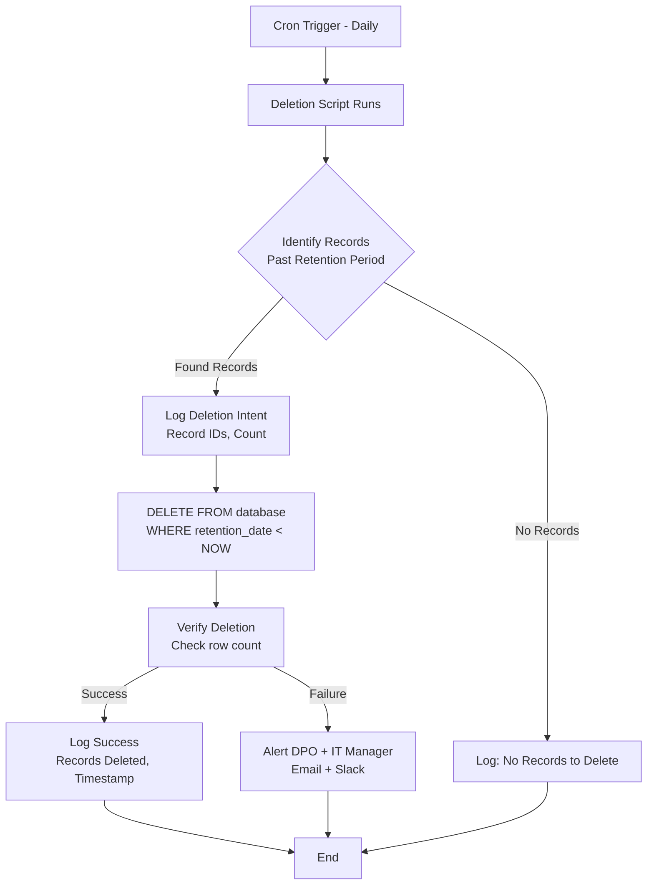

# Data Deletion Procedure | ขั้นตอนการลบข้อมูล

**Document Control | การควบคุมเอกสาร**

| Field | Value |
|-------|-------|
| **Document ID** | PROC-001 |
| **Version** | 1.0 |
| **Effective Date** | [To be filled - วันที่มีผลบังคับใช้] |
| **Review Date** | [Annual - ทบทวนทุกปี] |
| **Document Owner** | Data Protection Officer (DPO) |
| **Approved By** | Chief Executive Officer (CEO) |
| **Classification** | Internal Use Only - ใช้ภายในองค์กรเท่านั้น |
| **Related Standards** | ISO 27001:2022 A.8.10, PDPA Sections 23, 33 |

---

## 1. Purpose | วัตถุประสงค์

This procedure defines the process for **deleting Personal Data and other sensitive information** from Certogo's systems in accordance with:
- **PDPA Section 23**: Data retention limitation (retain only as long as necessary)
- **PDPA Section 33**: Data subject's right to erasure ("Right to be Forgotten")
- **ISO 27001:2022 A.8.10**: Information deletion
- **Contractual obligations**: Customer contracts, Data Processing Agreements (DPAs)

**🔴 CRITICAL**: This procedure includes **biometric data deletion** (facial images, ID card scans) processed by E-KYC provider, which requires special handling under PDPA Section 26.

**Thai | ไทย**: ขั้นตอนนี้กำหนดกระบวนการลบข้อมูลส่วนบุคคลและข้อมูลที่ละเอียดอ่อนอื่นๆ จากระบบของ Certogo

---

## 2. Scope | ขอบเขต

### 2.1 In Scope | อยู่ในขอบเขต

This procedure applies to deletion of:

**Data Types**:
- **🔴 Biometric data** (facial images, ID card scans) - PDPA Section 26 sensitive data, stored at E-KYC provider
- **Personal Data (PII)**: Names, email addresses, phone numbers, ID card numbers, addresses
- **User-generated content**: Course progress, quiz answers, certificates, support tickets
- **Business confidential data**: Customer contracts, pricing information (after retention period)
- **System data**: Access logs, audit trails (after retention period)

**Systems**:
- Production databases (PostgreSQL, MongoDB, Redis)
- File storage (S3, Azure Blob Storage)
- Backups (encrypted backups in Thailand and Singapore regions)
- **E-KYC provider systems** (Appman - biometric data) 🔴
- Logging and monitoring systems (SIEM, application logs)

**Triggers**:
- **Data retention period expiry** (automated deletion)
- **Data subject rights request** (user requests deletion under PDPA Section 33)
- **Account closure** (user deletes account or subscription ends)
- **Contract termination** (B2B customer cancels service)
- **Legal hold lifted** (data held for litigation, hold expires)

### 2.2 Out of Scope | นอกขอบเขต

- **Data required by law to retain** (accounting records - 7 years per Thai Revenue Code)
- **Anonymized data** (no longer Personal Data under PDPA)
- **Aggregated analytics** (cannot identify individuals)

---

## 3. Roles and Responsibilities | บทบาทและความรับผิดชอบ

| Role | Responsibilities |
|------|------------------|
| **Data Protection Officer (DPO)** | - Approve all manual deletion requests<br>- Verify E-KYC provider biometric data deletion 🔴<br>- Maintain deletion logs<br>- Handle Data Subject Rights requests |
| **IT Manager / Database Administrator** | - Execute manual deletion in databases<br>- Run automated deletion scripts<br>- Verify deletion completion<br>- Provide deletion confirmation to DPO |
| **CTO / DevOps Team** | - Develop and maintain automated deletion scripts<br>- Ensure backups are rotated (deleted data purged from backups within 30 days)<br>- Coordinate with E-KYC provider for biometric data deletion 🔴 |
| **CISO** | - Audit deletion procedures (quarterly)<br>- Review deletion logs<br>- Ensure secure deletion methods (data irrecoverable) |
| **Customer Support** | - Receive Data Subject Rights requests<br>- Forward deletion requests to DPO (within 24 hours)<br>- Communicate deletion completion to users |

---

## 4. Data Retention Schedule | ตารางระยะเวลาการเก็บข้อมูล

Before deletion, data must be retained according to this schedule:

| Data Type | Retention Period | Deletion Method | Legal Basis |
|-----------|------------------|-----------------|-------------|
| **🔴 Biometric data (at E-KYC provider)** | **30 days** from verification | **Automated** at E-KYC provider + **certificate of deletion** | PDPA Section 26 + DPA requirement |
| **E-KYC verification result (Pass/Fail)** | **90 days** from verification | Automated at Certogo | Business need + PDPA compliance |
| **Active user account data** | While account active + **90 days** after closure | Automated + manual (if requested earlier) | Contract performance |
| **Course enrollment and certificates** | **7 years** from course completion | Automated | Legal obligation (Thai Revenue Code) |
| **Marketing consent records** | Until consent withdrawn + **1 year** | Automated | PDPA Section 19 (proof of consent) |
| **Security logs (access, authentication)** | **1 year** | Automated | Legitimate interest (security investigations) |
| **Support tickets** | **2 years** from ticket closure | Automated | Legitimate interest (quality improvement) |
| **Deleted account data in backups** | **30 days** (until backup rotation) | Backup rotation (30-day cycle) | Technical necessity |
| **Transaction records (for accounting)** | **7 years** from transaction date | Automated | Legal obligation (Thai Revenue Code Section 71) |

**🔴 CRITICAL**: Biometric data MUST be deleted after 30 days - failure to delete is PDPA Section 26 violation.

---

## 5. Automated Deletion Process | กระบวนการลบอัตโนมัติ

### 5.1 Overview | ภาพรวม

Certogo uses **automated deletion scripts** to delete data when retention periods expire. This ensures:
- Timely deletion (no human error or delays)
- Consistent application of retention schedule
- Audit trail of deletions

### 5.2 Automated Deletion Script Schedule | ตารางการทำงานของสคริปต์ลบอัตโนมัติ

| Script Name | Runs | Target Data | Retention Check |
|-------------|------|-------------|-----------------|
| `delete_expired_ekyc_results.py` | Daily 02:00 UTC | E-KYC verification results | > 90 days old |
| `delete_closed_accounts.py` | Daily 03:00 UTC | Closed user accounts | > 90 days since closure |
| `delete_expired_marketing_consent.py` | Daily 04:00 UTC | Withdrawn marketing consent records | > 1 year since withdrawal |
| `delete_old_security_logs.py` | Daily 05:00 UTC | Security and access logs | > 1 year old |
| `delete_old_support_tickets.py` | Daily 06:00 UTC | Closed support tickets | > 2 years since closure |
| `rotate_backups.py` | Daily 07:00 UTC | Old backup files | > 30 days old |

**Execution Environment**: Cron jobs on secure management server (access restricted to DevOps team)

**Logging**: All deletions logged to `/var/log/data-deletion/[script_name].log` with timestamp, data type, count of records deleted

### 5.3 Automated Deletion Workflow | ขั้นตอนการลบอัตโนมัติ



### 5.4 Monitoring and Alerting | การติดตามและการแจ้งเตือน

**Success Criteria**:
- Script executes daily (no missed runs)
- Deletion logs show consistent activity
- No errors in deletion logs

**Alerts**:
- If script fails 2 consecutive days → Email to DPO + IT Manager + CISO
- If deletion count unexpectedly high (> 1000 records) → Email to DPO (verify not error)
- If E-KYC provider fails to confirm deletion → Escalate to CISO (potential PDPA violation) 🔴

---

## 6. Manual Deletion Process (Data Subject Rights Requests) | กระบวนการลบด้วยตนเอง

### 6.1 Trigger | เหตุการณ์เริ่มต้น

User submits **Data Subject Rights Request** for deletion under PDPA Section 33 (Right to Erasure).

**Request Channels**:
- Email: privacy@certogo.com
- Web form: certogo.com/privacy-request
- In-app: Account Settings → Privacy → "Delete My Account"
- Mail: Certogo Co., Ltd., [Address], Attn: Data Protection Officer

### 6.2 Step-by-Step Procedure | ขั้นตอนโดยละเอียด

#### Step 1: Request Receipt (Day 0)

**Who**: Customer Support receives request

**Actions**:
1. Log request in Data Subject Rights Request register (`/evidence/records/data-subject-requests.xlsx`)
   - Assign Request ID (DSR-2024-XXX)
   - Record: Date received, requester name, requester email, request type (Deletion)
2. Send acknowledgment email to requester within **24 hours**:
   ```
   Subject: Data Deletion Request Received - [Request ID]

   Dear [Name],

   We have received your request to delete your personal data from Certogo systems.

   Request ID: DSR-2024-XXX
   Date Received: YYYY-MM-DD

   We will process your request within 30 days as required by PDPA Section 33.
   If we need additional information to verify your identity, we will contact you.

   For questions, contact our Data Protection Officer at privacy@certogo.com.

   Best regards,
   Certogo Data Protection Team
   ```
3. Forward request to DPO (within **24 hours**)

**SLA**: Acknowledge within 24 hours

---

#### Step 2: Identity Verification (Day 1-3)

**Who**: DPO

**Actions**:
1. Verify requester identity to prevent unauthorized deletion:
   - **If request via email**: Check if email matches account email (low-risk verification)
   - **If request via web form**: User logged in (identity verified)
   - **If request via mail**: Request additional proof (copy of ID card, OTP sent to email/phone)
2. If identity CANNOT be verified:
   - Email requester: "We need additional information to verify your identity. Please provide [specific request]."
   - Wait for response (give 7 days)
   - If no response, close request as "Unable to Verify"

**SLA**: Complete verification within 3 days of request

---

#### Step 3: Deletion Eligibility Assessment (Day 4-7)

**Who**: DPO (with input from Legal if needed)

**Actions**:
1. Assess if deletion is **legally required** or if **exceptions apply**

   **Deletion REQUIRED if**:
   - ✅ Data no longer necessary for original purpose (e.g., user completed course, no longer needs account)
   - ✅ User withdraws consent AND no other legal basis exists
   - ✅ Data was unlawfully processed

   **Deletion MAY BE REFUSED if** (PDPA Section 34 exceptions):
   - ❌ Legal obligation to retain (e.g., accounting records - 7 years per Thai Revenue Code)
   - ❌ Legal claims (ongoing litigation requires data)
   - ❌ Legitimate interest outweighs deletion right (rare, must document justification)

2. Document decision:
   - If **deletion approved**: Proceed to Step 4
   - If **deletion refused**: Draft refusal email with clear justification, send to requester

**Example Refusal Email**:
```
Subject: Data Deletion Request - Partial Approval [Request ID]

Dear [Name],

We have reviewed your data deletion request (DSR-2024-XXX).

APPROVED FOR DELETION:
- Profile data (name, email, phone)
- Course progress data

RETAINED (WITH JUSTIFICATION):
- Certificate record for "Occupational Safety Training" completed on 2023-05-15
  Reason: Thai law requires us to retain training certificates for 7 years
  for regulated training (Thai Revenue Code Section 71).
  This record will be anonymized (your name replaced with "User-XXX").

You have the right to file a complaint with the Personal Data Protection
Committee (PDPC) at https://www.pdpc.or.th if you disagree with this decision.

Best regards,
[DPO Name]
Data Protection Officer
Certogo Co., Ltd.
```

**SLA**: Complete assessment within 7 days of verified request

---

#### Step 4: Deletion Execution (Day 8-25)

**Who**: IT Manager / Database Administrator (executes), DPO (oversees)

**Actions**:

**4a. Prepare Deletion Plan**:
DPO provides IT Manager with:
- Request ID (DSR-2024-XXX)
- User ID or email
- Data categories to delete (specify what to delete, what to retain)

**4b. Execute Deletion in Stages**:

**Stage 1: Certogo Systems Deletion**

1. **Database Deletion** (PostgreSQL, MongoDB, Redis):
   ```sql
   -- Example for PostgreSQL
   BEGIN TRANSACTION;

   -- Log deletion intent
   INSERT INTO deletion_audit_log (request_id, user_id, timestamp, data_type, status)
   VALUES ('DSR-2024-XXX', 'user-12345', NOW(), 'user_profile', 'in_progress');

   -- Delete user profile
   DELETE FROM users WHERE user_id = 'user-12345';

   -- Delete course progress (if not legally required)
   DELETE FROM course_enrollments WHERE user_id = 'user-12345';

   -- Delete support tickets
   DELETE FROM support_tickets WHERE user_id = 'user-12345';

   -- Anonymize certificates (if legally required to retain)
   UPDATE certificates
   SET user_name = 'Deleted User', user_email = NULL, user_phone = NULL
   WHERE user_id = 'user-12345';

   -- Update audit log
   UPDATE deletion_audit_log SET status = 'completed' WHERE request_id = 'DSR-2024-XXX';

   COMMIT;
   ```

2. **File Storage Deletion** (S3, Azure Blob):
   - Delete user-uploaded files (profile pictures, documents)
   - Command: `aws s3 rm s3://certogo-uploads/user-12345/ --recursive`

3. **Verification**:
   - Run SELECT queries to verify data deleted
   - Check file storage (confirm files no longer exist)
   - Document verification in deletion audit log

**Stage 2: E-KYC Provider Deletion** 🔴 (if user underwent E-KYC verification)

1. **Request Deletion from E-KYC Provider**:
   - DPO emails Appman (or API call if available):
   ```
   To: security@appman.co.th
   Subject: Biometric Data Deletion Request - User ID [user-12345]

   Dear Appman Security Team,

   Under our Data Processing Agreement (DPA) and PDPA Section 33, we request
   immediate deletion of biometric data for the following user:

   User ID (Certogo): user-12345
   Verification Date: 2024-01-15
   Transaction ID (Appman): [Appman's transaction ID if available]

   Please confirm deletion and provide a certificate of deletion within 7 days.

   Best regards,
   [DPO Name]
   Data Protection Officer
   Certogo Co., Ltd.
   Contact: privacy@certogo.com
   ```

2. **Follow-Up**:
   - If no response in 3 days, send reminder email
   - If no response in 7 days, escalate to CISO (DPA breach, PDPA violation risk)

3. **Receive Certificate of Deletion**:
   - Appman sends certificate: "Biometric data for User ID user-12345 has been deleted on YYYY-MM-DD. Transaction ID: [ID]. Signed: [Appman Security Manager]"
   - DPO files certificate in `/evidence/records/data-deletion-certificates/DSR-2024-XXX-ekyc-deletion.pdf`

**Stage 3: Backup Deletion**

**IMPORTANT**: Deleted data may exist in backups for up to **30 days** (backup rotation cycle).

1. **Mark for Deletion**:
   - Add user ID to "deletion list" that backup restoration scripts check
   - If backup is restored (disaster recovery), deletion script re-deletes this user's data

2. **Backup Rotation**:
   - After 30 days, old backups are overwritten
   - Deleted user's data is permanently removed from backups

**SLA**: Complete deletion (Certogo systems) within 20 days, E-KYC provider within 30 days total

---

#### Step 5: Verification and Confirmation (Day 26-30)

**Who**: DPO

**Actions**:
1. **Verify Deletion Completeness**:
   - Review deletion audit logs (confirm all stages completed)
   - Spot-check: Search for user ID in databases (should return 0 results)
   - Confirm E-KYC provider certificate of deletion received 🔴

2. **Document Deletion**:
   - Update Data Subject Rights Request register (status: "Completed")
   - File deletion evidence:
     - Database deletion logs
     - File storage deletion logs
     - E-KYC provider certificate of deletion 🔴
     - Screenshots of verification queries (0 results)

3. **Send Confirmation to Requester**:
   ```
   Subject: Data Deletion Completed - [Request ID]

   Dear [Name],

   We have completed your data deletion request (DSR-2024-XXX).

   DELETED:
   - Profile data (name, email, phone)
   - Course progress data
   - Biometric data (facial image, ID card scan) from our E-KYC provider ✅
   - Support ticket history

   RETAINED (WITH JUSTIFICATION):
   - Certificate for "Occupational Safety Training" (anonymized)
     Reason: Legal obligation to retain for 7 years (Thai Revenue Code)

   BACKUPS:
   - Your data may exist in backup files for up to 30 days. After 30 days,
     it will be permanently removed from all backups.

   Deletion completed on: YYYY-MM-DD

   If you have any questions, contact privacy@certogo.com.

   Best regards,
   [DPO Name]
   Data Protection Officer
   Certogo Co., Ltd.
   ```

**SLA**: Send confirmation within 30 days of verified request (PDPA Section 33 deadline)

---

## 7. Secure Deletion Methods | วิธีการลบอย่างปลอดภัย

### 7.1 Database Deletion | การลบฐานข้อมูล

**Method**: SQL DELETE or TRUNCATE statements

**Security**:
- ✅ Data is immediately unavailable to applications (DELETE removes row)
- ✅ Database space is reclaimed (VACUUM operation)
- ⚠️ **Limitation**: Data may be recoverable from database WAL (Write-Ahead Log) or disk blocks for short period

**Mitigation**:
- Encrypt databases at rest (AES-256) - even if data fragments remain, they are encrypted
- Regular WAL rotation and archival deletion

**Irrecoverability**: After database VACUUM and WAL rotation (happens within 24 hours), data is effectively irrecoverable

### 7.2 File Storage Deletion | การลบไฟล์

**Method**: Cloud provider DELETE API (S3, Azure Blob)

**Security**:
- ✅ Cloud provider immediately removes file from accessible storage
- ✅ File is removed from all replicas (multi-AZ)
- ⚠️ **Limitation**: Cloud provider may retain file in "deleted items" or backups for short period (typically 30 days)

**Mitigation**:
- Use server-side encryption (SSE) - deleted files are encrypted
- Lifecycle policies automatically purge deleted items after 30 days

**Irrecoverability**: After 30-day lifecycle policy, files are unrecoverable

### 7.3 E-KYC Provider Deletion 🔴

**Method**: E-KYC provider (Appman) uses their internal deletion process

**Security**:
- ✅ Contractual obligation (DPA requires deletion within 30 days)
- ✅ Certificate of deletion provided (proof)
- ⚠️ **Limitation**: Certogo cannot directly verify deletion (must trust E-KYC provider)

**Mitigation**:
- Annual audit of E-KYC provider (review deletion logs)
- E-KYC provider ISO 27001 certified (deletion processes audited by third party)

**Irrecoverability**: After E-KYC provider confirms deletion and provides certificate, data is considered irrecoverable

### 7.4 Backup Deletion | การลบข้อมูลสำรอง

**Method**: Backup rotation (30-day cycle)

**Process**:
- Daily incremental backups for 7 days
- Weekly full backups for 4 weeks
- After 30 days, oldest backup is overwritten by new backup

**Security**:
- ✅ Deleted data exists in backups for maximum 30 days
- ✅ Backups are encrypted (AES-256)
- ✅ After 30 days, old backup is overwritten (data irrecoverable)

**User Notification**: Users are informed that deletion from backups takes up to 30 days

---

## 8. Special Cases | กรณีพิเศษ

### 8.1 Biometric Data Early Deletion 🔴

**Scenario**: User requests deletion of biometric data BEFORE 30-day automated deletion.

**Procedure**:
1. DPO requests expedited deletion from E-KYC provider (Appman)
2. Appman deletes within 7 days (per DPA expedited deletion clause)
3. Certificate of deletion provided to DPO
4. Certificate provided to user upon request

**SLA**: 7 days for expedited biometric data deletion

---

### 8.2 Legal Hold (Litigation) | การระงับการลบเนื่องจากคดีความ

**Scenario**: User requests deletion, but data is subject to legal hold (ongoing lawsuit).

**Procedure**:
1. Legal team notifies DPO of legal hold (specific user IDs or data categories)
2. DPO marks user account as "Legal Hold" in system
3. Automated deletion scripts skip data under legal hold
4. DPO informs user:
   ```
   We cannot delete your data at this time due to ongoing legal proceedings.
   Your data will be deleted within 30 days after the legal hold is lifted.
   ```
5. When legal hold is lifted, Legal notifies DPO
6. DPO removes "Legal Hold" flag
7. Data is deleted per normal process (within 30 days)

**Compliance**: PDPA Section 34(2) allows retention for legal claims

---

### 8.3 Account Reactivation After Deletion Request | การเปิดบัญชีใหม่หลังจากขอลบ

**Scenario**: User requests deletion, then changes mind before deletion completed.

**Procedure**:
1. **If deletion NOT YET started** (still in assessment phase - Day 1-7):
   - DPO cancels deletion request
   - User receives email: "Your deletion request (DSR-2024-XXX) has been cancelled."

2. **If deletion IN PROGRESS** (Day 8-25):
   - Stop deletion if possible (before database DELETE commits)
   - If too late (database DELETE committed), inform user: "Deletion is already in progress and cannot be stopped. You may create a new account if desired."

3. **If deletion COMPLETED** (Day 26+):
   - Data cannot be recovered
   - User must create new account (new registration)

**User Communication**: Clearly explain deletion is **irreversible** after completion

---

## 9. Audit and Compliance | การตรวจสอบและการปฏิบัติตาม

### 9.1 Deletion Audit Logs | บันทึกการตรวจสอบการลบ

**What to Log**:
- Deletion request ID (DSR-2024-XXX)
- User ID or email
- Data type deleted (profile, course data, biometric data, etc.)
- Deletion method (automated script, manual SQL, E-KYC provider)
- Timestamp (start and completion)
- Who executed (DPO, IT Manager, automated script)
- Verification result (success, failure, partial)

**Log Storage**:
- `/var/log/data-deletion/` (server logs)
- `/evidence/records/data-deletion-audit-log.xlsx` (consolidated register)

**Log Retention**: 3 years (for PDPA compliance proof)

### 9.2 Quarterly Deletion Audit | การตรวจสอบการลบรายไตรมาส

**Who**: CISO audits, DPO provides logs

**Checklist**:
- [ ] Automated deletion scripts ran successfully (no missed days)
- [ ] Deletion counts consistent with expectations (no anomalies)
- [ ] All Data Subject Rights deletion requests completed within 30-day SLA
- [ ] E-KYC provider certificates of deletion received for all biometric deletion requests 🔴
- [ ] No data retention violations (data retained beyond schedule)

**Output**: Quarterly audit report filed in `/evidence/records/deletion-audit-reports/`

### 9.3 E-KYC Provider Deletion Verification 🔴

**Frequency**: Quarterly (in addition to per-request verification)

**Procedure**:
1. DPO requests summary report from E-KYC provider (Appman):
   - Number of deletion requests received from Certogo (last quarter)
   - Number of deletions completed
   - Any issues or delays
2. DPO compares against Certogo's records (should match)
3. If discrepancy, escalate to CISO (investigate)

**SLA**: E-KYC provider provides report within 15 days of quarter end

---

## 10. Training and Awareness | การฝึกอบรมและการสร้างการรับรู้

### 10.1 Mandatory Training | การฝึกอบรมบังคับ

**Who**: All employees with access to Personal Data (IT, DevOps, Customer Support, DPO team)

**Frequency**: Annually + upon hire

**Topics**:
- PDPA data retention and deletion requirements
- **Biometric data deletion** (30-day maximum, E-KYC provider coordination) 🔴
- Data Subject Rights (Right to Erasure)
- Secure deletion methods
- Legal hold procedures

**Assessment**: Quiz with minimum 80% pass rate

### 10.2 Role-Specific Training | การฝึกอบรมเฉพาะบทบาท

**IT Manager / Database Administrator**:
- Hands-on training: Execute manual deletion (test environment)
- Review deletion SQL scripts
- Verification procedures

**Customer Support**:
- How to receive and log deletion requests
- What information to collect for identity verification
- How to escalate to DPO

---

## 11. Continuous Improvement | การปรับปรุงอย่างต่อเนื่อง

### 11.1 Procedure Review | การทบทวนขั้นตอน

**Frequency**: Annual + after significant incidents

**Triggers for Review**:
- PDPA regulatory updates
- E-KYC provider change 🔴 (update references from Appman to new provider)
- Audit findings (internal or external)
- Deletion failures or delays

**Owner**: DPO proposes updates, CEO approves

### 11.2 Metrics | ตัวชี้วัด

| Metric | Target | Measurement |
|--------|--------|-------------|
| **Automated deletion success rate** | 100% (no failed scripts) | Daily monitoring |
| **Data Subject Rights deletion SLA compliance** | 100% within 30 days | Per request |
| **E-KYC biometric deletion SLA** 🔴 | 100% within 30 days (or 7 days if expedited) | Per request |
| **Certificate of deletion received** 🔴 | 100% from E-KYC provider | Quarterly audit |
| **Backup rotation compliance** | 100% (30-day cycle) | Monthly check |

**Review**: DPO reports metrics to CEO quarterly

---

## 12. Related Documents | เอกสารที่เกี่ยวข้อง

- **PDPA Compliance Policy** (POL-003)
- **Supplier Security Policy** (POL-004) - DPA with E-KYC provider
- **Information Security Policy** (POL-001)
- **Data Subject Rights Request Form** - certogo.com/privacy-request
- **Data Processing Agreement with E-KYC Provider** - `/evidence/contracts/appman-dpa-signed.pdf`

---

## 13. Approval | การอนุมัติ

**Approved By**:

```
_________________________________________
[CEO Name]
Chief Executive Officer
Certogo Co., Ltd.

Date: _______________
```

**Reviewed By**:

```
_________________________________________
[DPO Name]
Data Protection Officer
Certogo Co., Ltd.

Date: _______________
```

---

**END OF PROCEDURE | สิ้นสุดขั้นตอน**

**Document Classification**: Internal Use Only
**Version**: 1.0
**Last Updated**: [Date]
**Next Review**: [Date + 1 year]
